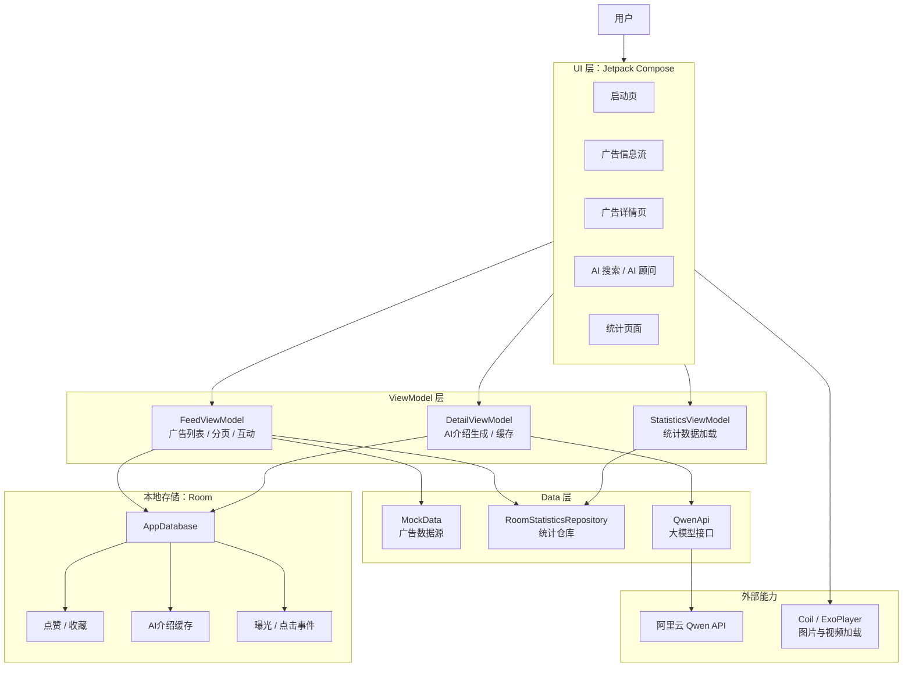
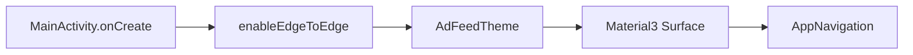
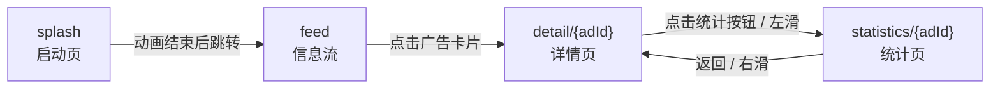
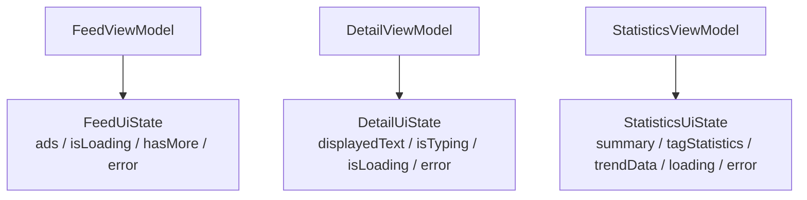
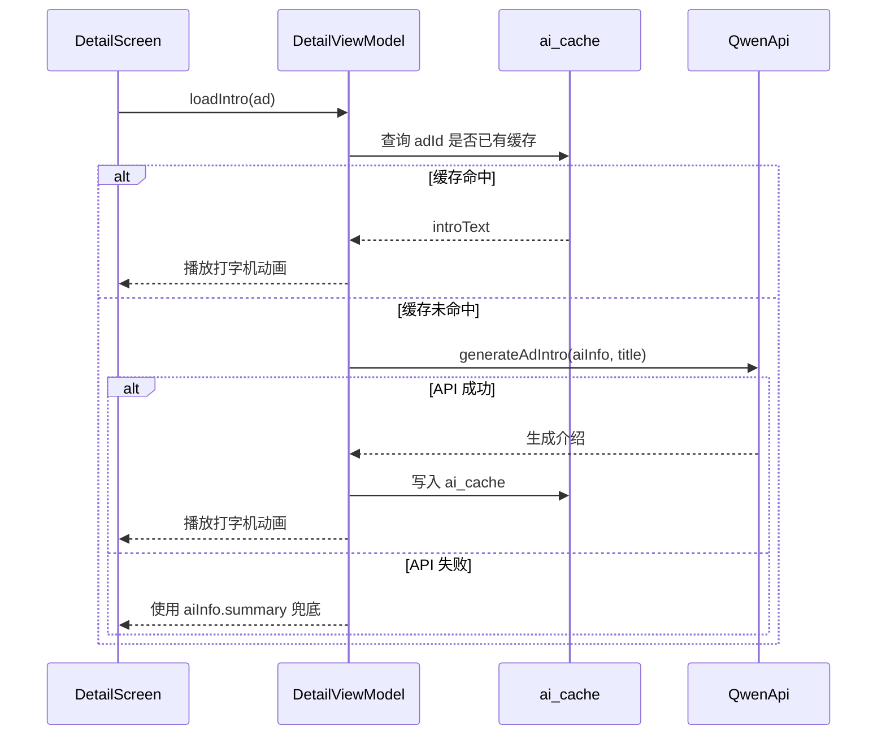
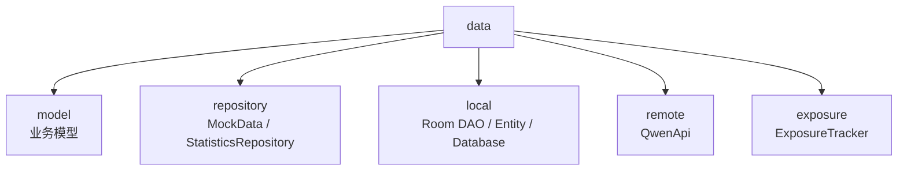

# adFeed

Android 广告信息流（Feed）应用，基于 Jetpack Compose 开发，模拟现代内容推荐平台的信息流浏览体验。

## 项目功能

### 信息流浏览

* 精选频道
* 电商频道
* 本地频道
* 左右滑动切换频道
* 下拉刷新
* 分页加载
* 大图广告卡片
* 小图广告卡片
* 视频广告卡片

### Tag智能筛选

* 高频Tag推荐
* 多Tag组合筛选
* 自定义Tag输入
* 卡片Tag快捷筛选
* 一键清空筛选

### AI增强能力

#### AI摘要

广告卡片展示AI生成摘要：

* 商品简介
* 核心卖点提炼

#### AI广告介绍

详情页自动生成广告介绍：

* 基于商品结构化信息生成
* 打字机动画展示
* 本地缓存避免重复请求

#### AI产品顾问

支持多轮问答：

* 商品特点咨询
* 适用人群分析
* 使用场景推荐
* 推荐理由解释

#### AI智能推荐

主页悬浮AI助手：

* 自然语言搜索
* AI推荐广告
* 搜索历史记录
* 推荐结果卡片展示

### 用户交互

* 点赞功能
* 收藏功能
* 状态持久化
* 详情页跳转
* 推荐广告跳转

### 动效体验

* 启动页动画
* AI悬浮球脉冲动画
* Tag筛选展开动画
* AI搜索面板展开动画
* AI介绍打字机动画

---

## 项目架构

单模块 Android App，模块 app，包名 com.example.adfeed

使用 **Jetpack Compose** 搭 UI

状态层使用 **ViewModel + StateFlow**

本地数据使用 **Room**

网络 AI 能力通过 HttpURLConnection 调用 **DashScope Qwen API**。

主要功能实现：

1. 广告信息流：频道、分页、刷新、卡片展示、Tag 筛选。
2. 用户互动：点赞、收藏、点击、曝光。
3. AI 能力：广告详情 AI 介绍、AI 产品顾问、AI 广告搜索。
4. 数据统计：曝光量、点击量、CTR、同 Tag 对比、7 天趋势。



### 启动与导航层

应用入口为`MainActivity.kt`



页面切换由`MainActivity.kt`中定义的`AppNavigation()`管理，其中有四个路由:



亲中FeedViewModel在`AppNavigation()`中创建，传给`FeedScreen`和`DetailScreen`，详情页可以直接复用信息流中的广告状态，无需重新请求

### Application与Room初始化

在`AdApplication`中在应用启动时创建数据库单例`AppdataBase`

数据库类为`AppDatabase.kt`

包含三张表：

1. interactions 保存用户互动状态，是否点赞，是否收藏等等
2. ai_cache 保存AI生成过的广告介绍，缓存命中可以避免重复请求大模型
3. Statistic_events 保存曝光和点击时间，不是只存总数，而是每次曝光、点击都插入时间，可以进行聚合分析

### UI层

`FeedScreen` 为信息流首页，包括以下内容：

1. 顶部三个频道：精选、电商、本地。
2. HorizontalPager 支持左右滑动切频道。
3. 每个频道内部用 LazyColumn 展示广告卡片。
4. 支持下拉刷新。
5. 支持自动加载更多，每页 6 条。
6. 支持 Tag 多选筛选。
7. 支持 AI 悬浮球搜索。
8. 支持曝光检测和点击统计。

`DetailScreen`为广告详情页，包括以下内容：

1. 顶部图片或视频。
2. 广告标题、描述、标签。
3. AI 生成介绍。
4. 点赞、收藏、分享操作。
5. AI 产品顾问入口。
6. 统计页面入口。

### ViewModel层



FeedViewModel负责信息流控制：

1. 当前频道 currentChannel。

2. 当前分页 currentPage。

3. 每页大小 pageSize = 6。

4. 当前乱序广告池 shuffledPool。

5. 从 Room 合并点赞收藏状态。

6. 记录点击和曝光。

7. 把统计事件写入 RoomStatisticsRepository。

8. ```mermaid
   sequenceDiagram
       participant UI as FeedScreen
       participant VM as FeedViewModel
       participant Mock as MockData
       participant Room as Room
   
       UI->>VM: loadAds()
       VM->>Mock: getByChannel(channel).shuffled()
       VM->>VM: 按 pageSize 截取 6 条
       VM->>Room: 查询 interaction
       VM->>Room: 查询 exposure/click count
       Room-->>VM: 本地状态与统计计数
       VM-->>UI: 更新 FeedUiState.ads
   ```

DetailViewModel负责详情页AI介绍：



StatisticsViewModel负责统计页面并行加载：

1. 当前广告统计摘要：曝光、点击、CTR。
2. 同 Tag 广告对比。
3. 最近 7 天趋势。

### Data层




其中model定义了核心数据结构

MockData是广告数据源，维护了所有的广告

StatisticsRepository为统计仓库接口，RoomStatisticsRepository 是统计仓库实现

ViewModel通过接口，数据来自Room


采用 MVVM 架构设计。

Data Layer

* AdItem
* AiInfo
* MockData
* QwenApi

ViewModel Layer

* FeedViewModel
* DetailViewModel

UI Layer

* FeedScreen
* DetailScreen
* LargeImageCard
* SmallImageCard
* VideoCard
* AiChatOverlay
* SplashScreen

---

## 数据模型

### AdItem

广告主体数据。

### AiInfo

广告AI分析数据。

包含：

* summary
* features
* targetUsers
* recommendReasons
* scenarios

用于：

* AI摘要展示
* AI介绍生成
* AI顾问问答

---

## 技术栈

* Kotlin
* Jetpack Compose
* Material3
* Navigation Compose
* ViewModel
* StateFlow
* Coroutines
* Coil
* Media3 ExoPlayer
* Qwen API
* HttpURLConnection

---

## 版本记录
### v1.0

* 基础信息流展示
* 点赞功能
* 收藏功能
* 视频广告卡片
* 广告详情页

### v1.1

新增：

* Tag筛选系统
* 多Tag组合筛选
* 自定义Tag输入
* 筛选面板悬浮动画
* AI聊天页面框架
* 启动页动画
* 左右滑动切换频道

优化：

* 下拉刷新逻辑
* Mock数据随机化展示
* TopBar布局重构

修复：

* 首次启动列表为空的问题

### v1.2

新增：

* AiInfo结构化数据模型
* AI广告摘要展示
* AI广告介绍生成
* AI介绍打字机动画
* AI产品顾问问答
* AI搜索推荐助手
* AI搜索历史记录
* AI悬浮球入口

优化：

* TabBar重构
* Pager切换逻辑优化
* 推荐广告跳转逻辑

修复：

* 推荐广告详情页找不到数据的问题
* AI入口与频道切换冲突问题

v2.0:

新增：

- 详情页显示收藏数并实现收藏数持久化
- 配置room数据库实现持久化
  - ViewModel直接调用room DAO数据库接口访问本地SQLite，实现交互逻辑
  - 统计数据则由ViewModel通过 Repository（封装统计业务）业务数据入口来访问DAO
- 实现ai介绍数据库缓存，防止多次重复调用api

优化：

- 网络层封装
  - 优化前`QwenApi.chat()` 和 `generateAdIntro()` 各自维护 `HttpURLConnection` 请求流程，重复的HTTP请求
  - 优化后构建core/network，实现底层网络能力，QwenApi无需写http请求细节，只需管理相应业务，同时保持QwenApi对外接口稳定
  - 可解析错误类型，分为 Success、ApiError、NetworkError三类错误，细化UI反馈

后续可优化：

- Interaction交互操作也通过repository封装业务逻辑，使data层结构上达成统一
- 将目前QwenApi的HttpURLConnection改为Retrofit，供后续AI功能扩展，使接口调用更规整
- 

---

## 后续规划

* AI推荐排序优化
* 云端点赞收藏同步
* 本地数据库缓存
