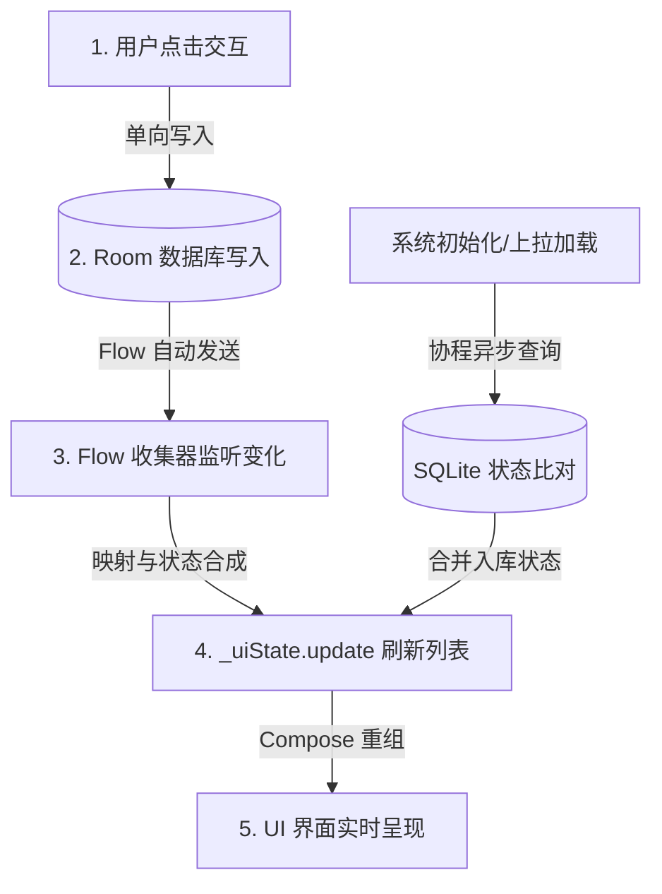

# Room 本地持久化与响应式数据驱动架构设计文档

本文件详细记录了本 Android 广告 Feed流项目在引入 **Room 数据库** 之后，在数据驱动机制上发生的本质变革，解析了当前响应式数据流动的全链路过程，并总结了重构后带来的核心技术优势与业务收益。

---

## 一、 重构前后的数据驱动方式对比

在引入 Room 数据库之前，项目的数据流是**纯内存临时拉取式**的；重构后，演变为以 **Room 数据库为唯一真实源（Single Source of Truth, SSOT）的响应式单向数据流**。

### 1. 架构对比概览

| 维度 | 重构前 (纯内存临时驱动) | 重构后 (Room + Flow 响应式驱动) |
| :--- | :--- | :--- |
| **数据源状态** | 分散的。内存 Mock 广告源列表 + ViewModel 中的临时 `localStates` 内存 Map。 | 统一的。本地 Room 数据库表是广告交互状态与 AI 缓存的**唯一真实源**。 |
| **状态持久性** | **无持久化**。应用进程一旦被系统杀掉或重启，用户的所有交互状态立即丢失。 | **强持久化**。所有数据写入磁盘 SQLite，即使断电、重启，状态依然得以保留。 |
| **数据更新模式** | **主动合并/拉取式**。由业务函数主动操作内存 Map，然后手动复制、合并并重新推送给 StateFlow。 | **响应式/自动发布式**。视图与业务只订阅数据库的 Flow 变动。业务只需单向写库，UI 自动感知变化。 |
| **大模型数据管理** | **无缓存机制**。每次进入详情页都必须发起耗时的 API 网络请求，无离线展示能力。 | **二级磁盘高速缓存**。首次生成写入数据库，二次进入秒开，断网自动优雅降级兜底。 |

### 2. 驱动机制差异分析

#### 重构前：双重源与内存 merge 逻辑
在重构前，ViewModel 依靠一个 `localStates` 的 `HashMap` 来缓冲用户在当前生命周期内的状态变动（如是否点赞、是否收藏）：
```kotlin
// 旧版逻辑示意：内存合并
private val localStates = HashMap<String, LocalAdState>()

private fun mergeLocalState(ad: AdItem): AdItem {
    val state = localStates[ad.id] ?: return ad
    return ad.copy(
        isLiked = state.isLiked,
        likeCount = ad.likeCount + state.likeCountOffset,
        isCollected = state.isCollected
    )
}
```
* **痛点**：这种设计极其脆弱。当我们在不同页面（比如列表页和详情页）都尝试修改同一个广告的状态时，为了保持同步，必须在多个 ViewModel 间传递复杂的事件或共享相同的内存引用，容易引起数据不一致的 Bug。

#### 重构后：单源信托（SSOT）与单向数据流
在引入 Room 之后，整个内存 Map 被彻底废弃。数据只在本地 SQLite 数据库中保存一份，UI 仅是数据库的影子。
* **数据流向**：`用户操作` ➡️ `写入数据库` ➡️ `触发数据库 Flow 发送` ➡️ `ViewModel 监听并更新 StateFlow` ➡️ `Compose UI 自动重组`。这是一个闭环的单向数据流。

---

## 二、 当前数据驱动机制的详细讲解

下面结合关键代码，从数据流动的 **5 个关键节点** 全面梳理目前的数据驱动流程。



### 1. 节点 A：数据库层定义的响应式契约 (Dao)
在 `InteractionDao` 中，除了定义传统的挂起函数，我们使用 Kotlin `Flow` 定义了可观察的查询契约。这使得任何对该数据表的改动，都将作为数据流序列自动向外发送。
```kotlin
@Dao
interface InteractionDao {
    // 挂起函数：用于一次性的查询与单向异步写入
    @Query("SELECT * FROM interactions WHERE adId = :adId")
    suspend fun getInteraction(adId: String): InteractionEntity?

    // 响应式 Flow：当表内任意数据发生 Insert/Update/Delete 时，其收集器（Collector）会收到最新数据集的推送
    @Query("SELECT * FROM interactions")
    fun getAllInteractionsFlow(): Flow<List<InteractionEntity>>
}
```

### 2. 节点 B：ViewModel 层的管道建立 (observeDatabaseChanges)
在 `FeedViewModel` 初始化（`init`）时，我们建立了对数据库的监听管道。这个管道长驻于 ViewModel 的生命周期中，用于将底层数据库的变动实时“投影”到 UI 的 `ads` 列表中。
```kotlin
private fun observeDatabaseChanges() {
    viewModelScope.launch {
        // 1. 订阅数据库交互表的 Flow 推送
        AdApplication.database.interactionDao().getAllInteractionsFlow().collect { interactions ->
            // 将逆向查询到的实体列表转化为 Map 以便于 O(1) 的高效匹配
            val interactionMap = interactions.associateBy { it.adId }
            
            // 2. 响应式更新 UI State
            _uiState.update { state ->
                state.copy(ads = state.ads.map { ad ->
                    val entity = interactionMap[ad.id]
                    if (entity != null) {
                        // 如果数据库里存在该广告的交互记录，将其最新状态及计数偏移合并至 UI 模型中
                        ad.copy(
                            isLiked = entity.isLiked,
                            likeCount = ad.likeCount + entity.likeCountOffset,
                            isCollected = entity.isCollected
                        )
                    } else {
                        ad
                    }
                })
            }
        }
    }
}
```

### 3. 节点 C：初始加载与首屏状态比对 (loadAds)
当用户进入 App 或上拉加载更多广告时，数据流从 Mock 仓拉取基础数据包。为了保证展示出来的第一帧就带有正确的交互状态（如点赞红心），在构建列表时我们需要同步比对数据库：
```kotlin
val newAds = withContext(Dispatchers.IO) {
    shuffledPool.subList(start, end).map { ad ->
        // 在 IO 协程中，一次性查询数据库中是否存在该广告的历史交互记录
        val entity = AdApplication.database.interactionDao().getInteraction(ad.id)
        if (entity != null) {
            // 合并已持久化的状态
            ad.copy(
                isLiked = entity.isLiked,
                likeCount = ad.likeCount + entity.likeCountOffset,
                isCollected = entity.isCollected
            )
        } else ad
    }
}
```

### 4. 节点 D：用户交互时的单向数据库写入 (toggleLike)
当用户点击列表中的心形图标时，ViewModel 不会去修改 `ads` 列表的任何字段，甚至不直接在主线程修改 UIState。它唯一的工作是向数据库投递一个修改动作：
```kotlin
fun toggleLike(adId: String) {
    viewModelScope.launch(Dispatchers.IO) {
        val dao = AdApplication.database.interactionDao()
        // 1. 从库中读取当前的状态
        val entity = dao.getInteraction(adId) ?: InteractionEntity(adId, false, false, 0, 0, 0)
        val newLiked = !entity.isLiked
        // 2. 计算点赞数偏移量的累计（点赞则 +1，取消则 -1）
        val newOffset = entity.likeCountOffset + (if (newLiked) 1 else -1)
        
        // 3. 单向插入/更新数据库
        dao.insertOrUpdate(entity.copy(isLiked = newLiked, likeCountOffset = newOffset))
        
        // 注意：这里没有任何更新 UI 的代码！
        // 数据库写入完毕后，Room 会自动向节点 B 注册的 Flow 发送新通知，
        // 从而自动且安全地更新 _uiState，触发 Compose 重组完成视图刷新。
    }
}
```

### 5. 节点 E：大模型详情加载的缓存比对与容灾流程
在广告详情页中，我们引入了高速磁盘缓存，并保证了在网络离线时的优雅兜底：
```kotlin
// DetailViewModel.kt
fun loadIntro(ad: AdItem) {
    val aiInfo = ad.aiInfo ?: return
    viewModelScope.launch {
        _uiState.value = DetailUiState(isLoading = true)
        
        // 步骤 1：同步查询本地 AICacheEntity 高速磁盘缓存表
        val cached = withContext(Dispatchers.IO) {
            AdApplication.database.aiCacheDao().getAICache(ad.id)
        }
        
        if (cached != null) {
            // 【缓存命中】：绕过网络，立刻秒开渲染大文本，执行打字机动效
            startTypingAnimation(cached.introText)
            return@launch
        }

        // 步骤 2：【缓存未命中】，发起网络大模型 API 调用生成广告介绍
        QwenApi.generateAdIntro(aiInfo, ad.title).fold(
            onSuccess = { text ->
                // 生成成功：异步写入本地 Room 缓存表，以便下次进入时秒开
                withContext(Dispatchers.IO) {
                    AdApplication.database.aiCacheDao().insertCache(
                        AICacheEntity(
                            adId = ad.id,
                            summary = aiInfo.summary,
                            introText = text,
                            timestamp = System.currentTimeMillis()
                        )
                    )
                }
                startTypingAnimation(text)
            },
            onFailure = {
                // 步骤 3：【接口失败/网络异常】：优雅降级，提取基础数据中的 summary 做打字机显示
                val fallbackText = aiInfo.summary
                startTypingAnimation(fallbackText)
            }
        )
    }
}
```

---

## 三、 配置 Room 后的改动与技术优势

### 1. 核心改动点汇总
1. **依赖升级**：集成了 Room 2.8.4 及其 KSP 编译器，使用了内置 Kotlin 支持，抛弃了有性能阻碍的 kapt。
2. **架构重塑**：
   - 移除了 `FeedViewModel` 中的临时状态 Map 与 merge 函数。
   - 增加了 `com.example.adfeed.data.local` 的完整包结构（含 `entity` 实体、`dao` 接口、`db` 数据库管理器）。
   - 在 `AdApplication` 中增加了 Room 的初始化和 Destructive Migration 支持。
3. **数据流动响应式改造**：所有交互均以数据库读写为主导，以协程的 Flow 推送为主线。

### 2. 带来的核心技术优势与业务收益

#### 优势一：真正的状态全局一致性 (Single Source of Truth)
* **技术解析**：在多界面架构中，最忌讳的是状态不同步（例如：用户在详情页点赞了某个广告，返回列表页时爱心却还是灰色的）。
* **收益**：重构后，由于列表页和详情页都在观察同一个本地数据库表，一旦详情页修改了数据库，列表页的 Flow 会立刻收到回调并完成 UI 刷新。状态割裂问题被在架构层彻底消灭。

#### 优势二：强容灾与离线防数据丢失 (Robust Data Persistence)
* **技术解析**：以前所有的数据都驻留在 JVM 的堆内存中，只要 App 被杀掉或在后台被系统清理，用户的任何操作记录全部化为乌有。
* **收益**：所有点击、点赞、收藏直接入库。下次打开 App 时，用户依然可以看到上一次的使用痕迹，提供了真正符合生产环境标准的用户体验。

#### 优势三：大模型请求开销削峰与秒开体验 (AI Response Acceleration)
* **技术解析**：大模型生成内容的耗时较长（通常在 1.5s 到 3s 之间），且多次重复调用会造成高昂的 API 调用开销与 Token 浪费。
* **收益**：本地二级磁盘高速缓存的引入，实现了“一次调用，终身秒开”。用户第二次点击详情页时完全不需要等待网络请求，零秒直接打字机展现，既极大地优化了用户感知性能，又保护了后端的 API 调用成本。

#### 优势四：网络崩溃下的高可用兜底 (Graceful Degradation)
* **技术解析**：移动端网络环境复杂多变，随时可能遭遇弱网、断网或大模型接口过载。
* **收益**：即使接口请求报错，程序也会从 `aiInfo.summary` 提取摘要自动填充渲染。详情页不会变成空白转圈，确保了 App 在极端环境下依旧保留了 80% 的核心可读功能。
