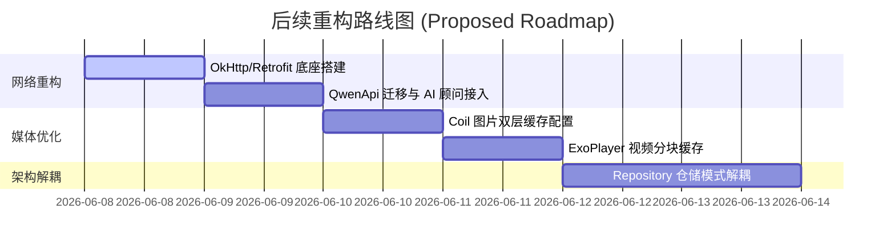

# 项目后续待办任务列表 (Remaining Tasks List)

为了完成我们完整的重构设计（参见设计文档 [dataLayer-aiIntegration-design.md](file:///Users/Zhuanz/adFeed/docs/dataLayer-aiIntegration-design.md)），使网络层与媒体优化层也具备健壮的结构，我们梳理了以下尚未实施的待办任务：

---

## 任务模块一：底层网络框架重构 (Network Layer)

### 1. 搭建 OkHttp/Retrofit 底座
* **位置**：`com.example.adfeed.core.network` 包
* **任务说明**：
  - [ ] 实现统一网络结果封装 `NetworkResult<T>`，包含 `Success`、`Error` 和 `Exception` 状态，以便 ViewModel 优雅处理各种业务错误。
  - [ ] 编写自动重试拦截器 `RetryInterceptor.kt`。在发生网络连接异常（`IOException`）或服务器 5xx 故障时，自动重试最多 2 次，提高网络弱网环境可用性。
  - [ ] 编写故障与延时模拟拦截器 `MockInterceptor.kt`。支持 Mock/Real 双模式切换，允许模拟 1 秒的网络延迟以及自定义的接口出错概率，拦截 Qwen API 的网络请求并返回模拟的 JSON 内容。

### 2. 迁移大模型网关 (QwenApi) 至 Retrofit
* **位置**：`com.example.adfeed.data.remote` 包
* **任务说明**：
  - [ ] 废弃 [QwenApi.kt](file:///Users/Zhuanz/adFeed/app/src/main/java/com/example/adfeed/data/remote/QwenApi.kt) 中原先使用传统阻塞式 `HttpURLConnection` 的请求写法。
  - [ ] 定义 Retrofit 请求接口 `QwenService.kt`，利用 `Moshi` 或 `Gson` 转换器自动反序列化通义千问大模型的 API 请求体和响应体。
  - [ ] 将 Qwen 客户端实例注入应用，在 `DetailViewModel` 中改用新的代理网络服务，并优化 `AiChatViewModel`（AI 顾问聊天室）的接口，实现异常状态下的降级展示。

---

## 任务模块二：媒体资源加载与高速缓存 (Media Caching)

### 1. Coil 智能图片双层缓存
* **位置**：`com.example.adfeed.core.util` / `AdApplication.kt`
* **任务说明**：
  - [ ] 编写图片加载器提供者 `ImageLoaderProvider.kt`。
  - [ ] 在 `AdApplication.onCreate()` 中，设置全局唯一的 Coil ImageLoader。
  - [ ] 限制内存占用最多不超过运行内存的 20%，并在 App 缓存目录下分配最大 100MB 的专用图片磁盘 LRU 缓存，保证 Feed 流在快速滑动时无需重复请求网络图片。

### 2. ExoPlayer 视频分块磁盘缓存 (Video Cache)
* **位置**：`com.example.adfeed.core.util` / 视频播放组件
* **任务说明**：
  - [ ] 编写全局唯一的视频缓存管理器 `VideoCacheManager.kt`。
  - [ ] 使用 ExoPlayer 的 `SimpleCache` 构建 50MB 大小的视频本地高速缓存目录。
  - [ ] 封装 `CacheDataSource.Factory` 数据源工厂，将其应用在所有 `Player` 实例的初始化中，让视频播放卡片能够在滑动到可见区域时实现“秒开即播”，极大减少重复播放造成的流量开销。

---

## 任务模块三：数据仓储模式解耦 (Repository Pattern)

### 1. 建立 Repository 接口与实现层
* **位置**：`com.example.adfeed.data.repository` 包
* **任务说明**：
  - [ ] 目前 ViewModel 依然在代码中直接依赖 `AdApplication.database` 去操作数据库，这违背了依赖倒置原则。
  - [ ] 定义 `AdRepository` 和 `InteractionRepository` 接口，提供统一的数据拉取和状态修改契约。
  - [ ] 编写 `AdRepositoryImpl` 和 `InteractionRepositoryImpl` 实现类，在内部将 `InteractionDao`、`AICacheDao` 和 Retrofit API 网关封装在一起。
  - [ ] 重构 `FeedViewModel` 与 `DetailViewModel`，让其构造函数接收 Repository 实例，解除 ViewModel 与数据库实例、API 实例的直接耦合，方便进行单元测试。

---

## 任务执行建议与路线图

